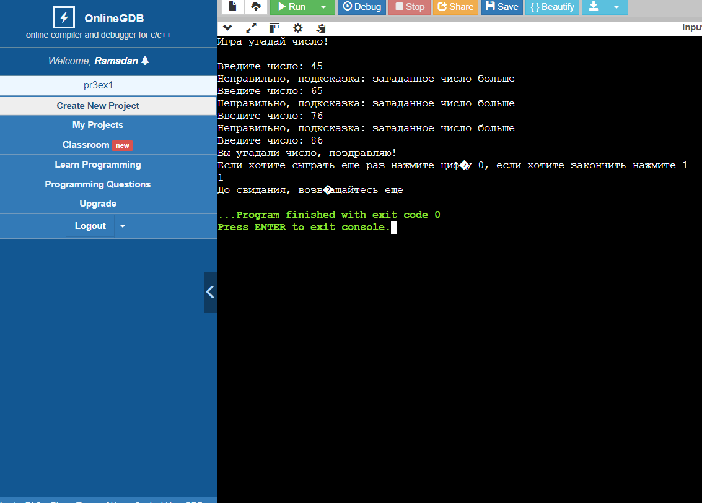

# Практическая работа №3. Консольные мини-игры (Часть 1)
## Цели:
 -Научиться реализовывать функции для решения конкретных задач и
  повышения читаемости и переиспользуемости кода.
  
  -Научиться генерировать случайные числа.
  
  -Научиться работать с файлами.

  ## Игра Угадай число
  Суть игры в том что игрок должен угадать число которое комьютер сгенерировал случайным образом

  ### Скриншот

## Игра придумай историю
Суть в том что компьютер случайным образом генерирует истории

### Скриншот

